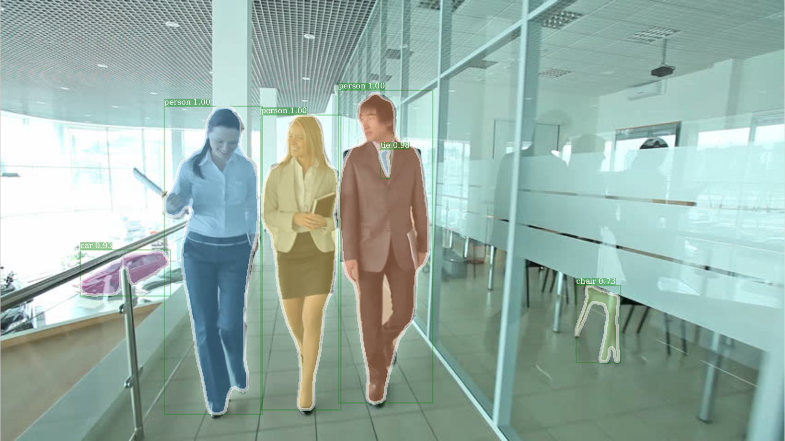

# Instant Object Segmentation and Detection using different Backbone Architectures
**Team Members: Srikanth Kilaru, Michael Wiznitzer, Solomon Wiznitzer**

Northwestern University ME 349: Machine Learning (Spring 2018)

## Abstract

## Setup and Installation

### Google Cloud Platform (GCP)

One of the requirements to use Detectron is a NVIDIA GPU. To gain access to this resource, we each created free accounts on [Google Cloud](https://cloud.google.com/) using our *personal* email addresses and credit cards. Unfortunately, the free version (although it does give $300 credit for the first year) does not allow access to GPUs so we upgraded our accounts. We then followed the instructions [here](https://cloud.google.com/compute/quotas) to get access to 8 K80 GPUs.

After creating a project, we then made a VM Instance with the following settings:
* **Zone:** us-central or us-west
* **Machine type:**
    * *Cores:* 4 vCPUs
    * *Memory:* 20 GB memory
    * *GPU:* 1,2, or 8 K80 GPUS
* **Boot Disk:** 
    * *OS Image:* Ubuntu 16.04 LTS
    * *Boot Disk Type:* Standard persistent disk
    * *Size:* 500 GB
* **Firewalls** - Allow HTTP and HTTPS traffic

*Note: During the course of the project, we used either 1, 2, or 8 GPU K80s for model training. Addtionally, we chose to use Ubuntu Linux 16.04 as the OS image since all of us are familiar with it. Finally, we decided to use a standard persistent disk with 500 GB storage since this was cheaper than a solid-state drive and would be able to store the [PASCAL VOC image dataset](http://host.robots.ox.ac.uk/pascal/VOC/voc2012/index.html#devkit) as well as the [COCO dataset](http://cocodataset.org/#download).*

Finally, we installed the [Google Cloud SDK](https://cloud.google.com/sdk/docs/quickstart-debian-ubuntu) on our *local* machines and followed the instructions [here](https://cloud.google.com/sdk/gcloud/reference/compute/scp) so that we could copy files (specifically classified/inferred images) from the VM to our laptops.

### Detectron

After booting up the VM instance, we followed the directions outlined in [Detectron's repo](detectron/INSTALL.md) to install [Caffe2](https://caffe2.ai/docs/getting-started.html?platform=ubuntu&configuration=compile) from source, some standard Python packages, and the COCO API. During installation, we found (after countless hours of debugging) some issues that we fixed as follows:
* In the 'Install Dependencies' section on the Caffe2 'Install' page, we added `python-setuptools` to the `sudo apt-get install` command.
* In the 'Install cuDNN (all Ubuntu versions) section on the Caffe2 'Install' page, instead of registering to get the Version 6.0, we just switched all appearances of `v5.1` in the gray command window to `v6.0` which worked just fine.
* When doing the `sudo make install` in the 'Clone & Build' section of the Caffe2 'Install' page, we added the flag `-DUSE_MPI=OFF` so that the final command was `sudo make install -DUSE_MPI=OFF`.
* After the installation (which took a little over an hour), but before checking to see if the Caffe2 installation was successful, we edited the `bash.rc` file to update the `PYTHONPATH` environment variable to `export PYTHONPATH="/home/<user>/pytorch/build/"`

The above tweaks took many hours to figure out but once completed, the check to determine whether or not Caffe2 installed properly outputted 'Success'.

### VNCServer

In order to easily browse the internet for image datasets and look through the Home Folder, we installed a VNCserver by following the instructions [here](https://cloudcone.com/docs/article/install-desktop-vnc-ubuntu-16-04/). For clients, we just installed any VNC client like the Remmina Remote desktop client, VNCViewer, or KRDC.

Also, we made a firewall rule in the GCP to allow communication between the server and the client as outlined in the 'Open the firewall' section [here](https://medium.com/google-cloud/graphical-user-interface-gui-for-google-compute-engine-instance-78fccda09e5c).

### Initial Test

For fun, we tested a pretrained Mask R-CNN model using a ResNet-101-FPN backbone on some test images provided by Detectron as well as an image we randomly found online. We ran the code shown under option 1 [here](/detectron/GETTING_STARTED.md). The result which correctly classified a number of people, a tie, a car, and a chair can be seen below.

## Streams 1 and 2

### <u>Stream 1</u>

#### Development and Implementation

#### Results and Analysis

### <u>Stream 2</u>

#### Development and Implementation

#### Results and Analysis

## Conclusion

